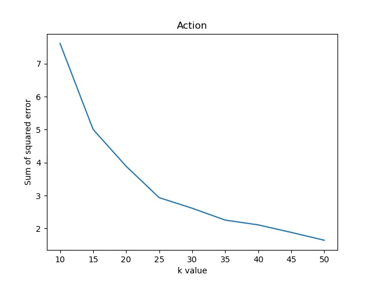
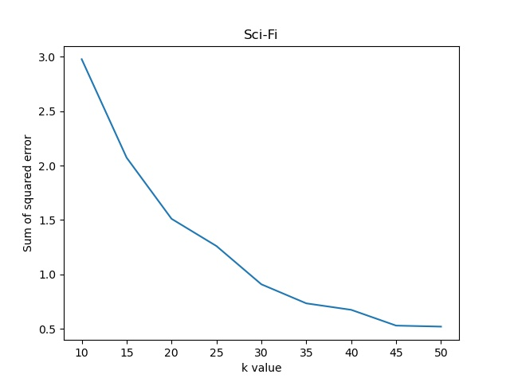
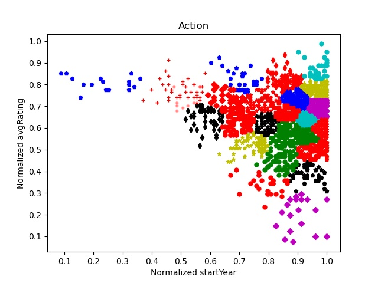
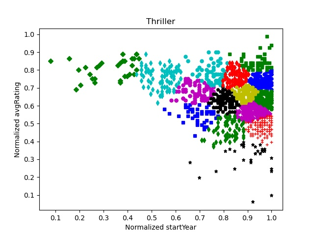
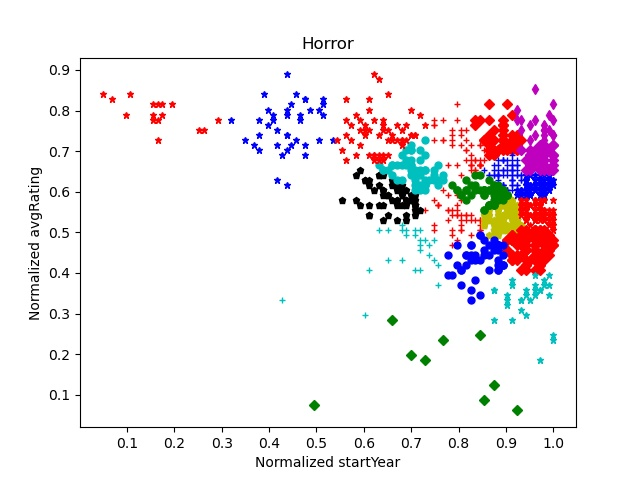

# bd-assignment-8
Assignment 8 – Clustering

## Question 1
In the root of the repo, run the following:
```bash
mongo q1.js
```

## Question 2
In the root of the repo, run the following:
```bash
python3 q2.py {k-value} {genre-name}
```

## Question 3
In the root of the repo, run the following:
```bash
python3 q3.py {genre-name}
```

## Question 4
In the root of the repo, run the following:
```bash
python3 q4.py 10 50 5 100
```
You can see the graphs in `./img/q4` directory. Below are the graphs of one particular test.

> **Action**: 
>
> 
> 
> k = 25

> **Romance**: 
>
> 
> 
> k = 35

> **Horror**: 
>
> 
>
> k = 20

> **Sci-Fi**: 
>
> 
> 
> k = 20

> **Thriller**: 
>
> 
>
> 15

## Question 4
In the root of the repo, run the following:
```bash
python3 q5.py
```
You can see the graphs in `./img/q5` directory. Below are the graphs of one particular test.
> **Action Clusters**: 
>
> 
> 
> Consider the cluster of red plus(<span style="color:red">+</span>). It shows the action movies released in the normalized startYear of 0.35 to 0.55 (equivalent to approximately 1951 to 1971) are all rated between 6.5 and 9.1.

> **Thriller Clusters**: 
>
> 
>
> Consider the cluster of black stars (<span style="color:black">★</span>). It shows that these thriller movies which are released between the years 1976 to 2018 are all not that great (have a rating of 4/10 or lower).

> **Romance Clusters**: 
>
> 
> 
> Consider the cluster of black pentagons (<span style="color:black">⬟</span>). It shows all the latest movies (released in the past decade) of genre "Romance" that are very good (rated between 8 and 9).

> **Horror Clusters**: 
>
> 
>
> Consider the cluster of green circles (<span style="color:green">●</span>, not <span style="color:green">◆</span>). It shows all the moderately rated (5.5 to 7) horror movies between the years 1996 and 2007.

> **Sci-Fi Clusters**: 
>
> 
>
> Consider the cluster of black stars (<span style="color:black">★</span>). It shows the moderately rated Sci-Fi movies released between the years 1976 and 1996.

