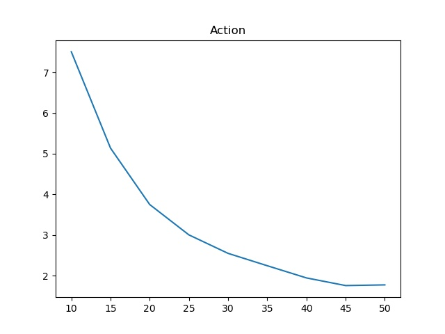
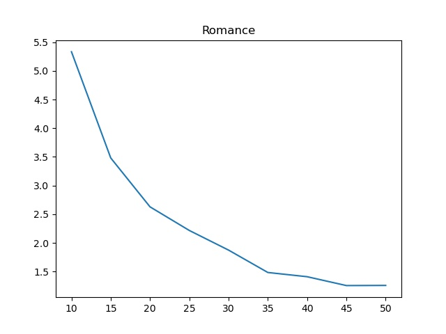
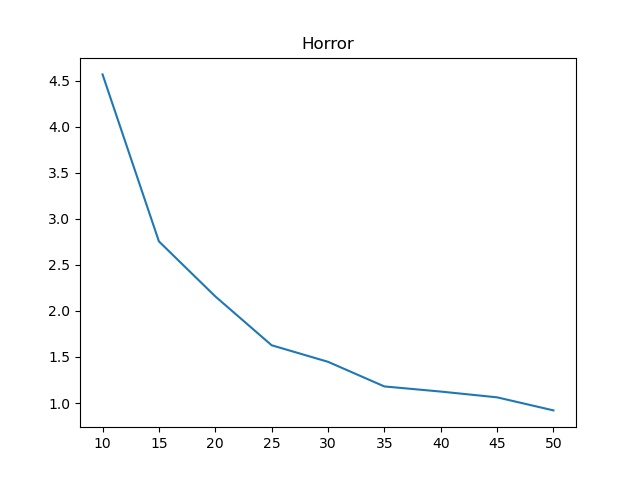
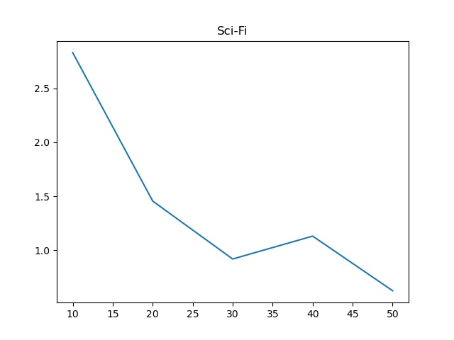
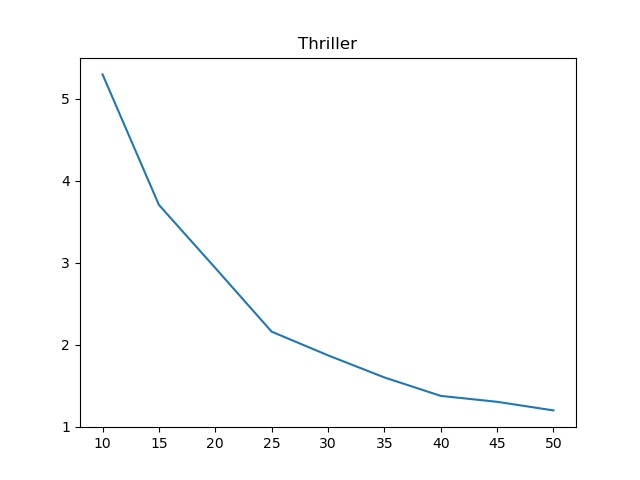

# bd-assignment-8
Assignment 8 – Clustering

## Question 1
In the root of the repo, run the following:
```bash
mongo q1.js
```

## Question 2
In the root of the repo, run the following:
```bash
python3 q2.py {k-value} {genre-name}
```

## Question 3
In the root of the repo, run the following:
```bash
python3 q3.py {genre-name}
```

## Question 4
In the root of the repo, run the following:
```bash
python3 q4.py 10 50 5 100
```

> **Action**: 
>
> 

> **Romance**: 
>
> 

> **Horror**: 
>
> 

> **Sci-Fi**: 
>
> 

> **Thriller**: 
>
> 